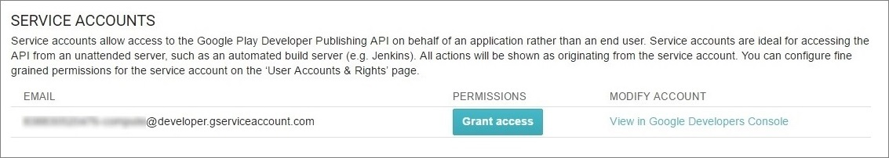
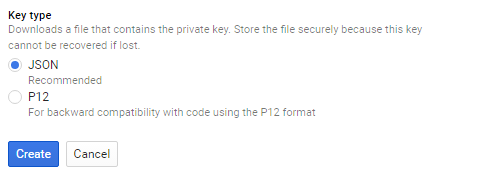

[](https://github.com/igrigorik/ga-beacon)
[](https://lima.codeclimate.com/github/levabd/android-version-checker)

# About

This is unofficial service-wrapper of Google Play Developer API for retrieving
Android app version that currently located on Google Play Store in simple
JSON (REST) response.

Just call GET request `/?id={com.app.app}` and get last app version (Beta
versions not captured)

# Attention!!!

Request to Google Play Developer API takes about 3 second. That's why this
service cached app version for 4 hour. So you will receive information from
the delay up to 4 hours.

# Table of contents

- [Why?](#why)
- [Installation](#installation)
- [Python Version](#python-v)
- [Configuration](#configuration)
- [Running](#running)
- [Service API reference](#api)
  - [GET /?id={com.app.app}](#get-version)
- [Contributing](#contributing)
- [License](#license)

# <a name="why"></a> Why?

You have put your app on the Google Play Store. It has been installed by
lots of customers. The users should check the auto-update check box in the
Play Store app for each app they want to auto-update. However some users have
unchecked it or not checked it in the first place. 
  
So you may want to use some service to pragmatically check if there is an
updated version of my app on the Play Store. If there is an updated
version then the user could be directed to the Play Store. 

Google Play does not provide any official APIs for retrieving metadata in
simple way.

So I found several solution on stackoverflow. There are 2 types of them:

1. Use some open web services like 
   [https://androidquery.appspot.com/api/market?app=org.ligi.fast](https://androidquery.appspot.com/api/market?app=org.ligi.fast) or
   [http://carreto.pt/tools/android-store-version/?package=org.ligi.fast](http://carreto.pt/tools/android-store-version/?package=org.ligi.fast)
2. Use own API with hardsaved app version on backend
3. Use [http://api.playstoreapi.com/v1.1/apps](http://api.playstoreapi.com/v1.1/apps)
4. Get version value from your Google Play Store page. ([http://stackoverflow.com/questions/25201349/programmatically-check-play-store-for-app-updates](http://stackoverflow.com/questions/25201349/programmatically-check-play-store-for-app-updates) and [http://stackoverflow.com/questions/7298106/how-to-allow-users-to-check-for-the-latest-app-version-from-inside-the-app](http://stackoverflow.com/questions/7298106/how-to-allow-users-to-check-for-the-latest-app-version-from-inside-the-app) and many others)

**First** services just wrapper for web page or hosted on google app engine
which usually outage when daily free quota used up.

With **Second** solution you have to update hardcoded version number every
release. For example we release a new version every week and forgot to
update hardcoded version number saved on our backend.

**Third**. www.playstoreapi.com is not available anymore.

**Fourth** solution is pretty good. You have to get this value from your 
Google Play Store page.

```
<div class="content" itemprop="softwareVersion">1.2.5</div>
```

**But** you have to update the app when something in html is changed. And
this method have another side effect. Google don't show app version number
when you use several platforms (x86 and armeabi-v7a). For example
[https://play.google.com/store/apps/details?id=com.wipon.wipon](https://play.google.com/store/apps/details?id=com.wipon.wipon) page have not
version number on it. 

That's why I'd like to use Google Play Developer API and fake deploy
mechanism to get apk's list. This method is the most stable in my opinion.
It realised in this repo

# <a name="installation"></a> Installation

pip install -r requirements.txt

# <a name="python-v"></a> Python Version

Python 2.6 or 2.7 are fully supported. This requirement flew from google-api-python-client

Python 3.3+ is also now supported! However, this service has not yet been used
as thoroughly with Python 3, so I'd recommend testing before deploying with
Python 3 in production.

# <a name="configuration"></a> Configuration

Configuration is simply copying the OAuth2 key to project folder.

1. Go to the APIs Console and log in with your Google Play Developer Console account.
2. Go to Settings → API access
3. Turn the Google Play Android Developer API on if it's not
4. Create or link Google Developer Project with Google Play Developer Console account


5. Go to Service Accounts and Grant Access to this account


6. Click Add user on window above

7. Generate OAuth service account in Google Developer Console

8. Create JSON (NOT p12) keyfile and **Save as** `key.json` **in the project directory**

9. That's it

More details on official docs [https://developers.google.com/android-publisher/authorization](https://developers.google.com/android-publisher/authorization)

# <a name="running"></a> Running

Start `android_version_checker`

## For development or local (5005 port)

```
python android_version_checker.py
```

## For staging or testing (5005 port)

```
sh ./start-stage.sh
```

Optionally you can use `supervisor/staging_android_version_checker.conf`
supervisor program config.

## For production (Debian or Ubuntu + NGINX + Gunicorn)

You can follow this link [https://www.digitalocean.com/community/tutorials/how-to-serve-flask-applications-with-gunicorn-and-nginx-on-ubuntu-16-04](https://www.digitalocean.com/community/tutorials/how-to-serve-flask-applications-with-gunicorn-and-nginx-on-ubuntu-16-04)
or instruction below.

For example I use /var/www/android-version-checker as project folder.

##### 1. Install virtualenv

```
$ sudo apt-get install virtualenv
```

##### 2. From project folder

```
$ cd /var/www/android-version-checker
```

##### 3. Set up virtualenv

```
$ virtualenv env
$ source env/bin/activate
```

##### 4. Update pip and install gunicorn

```
$ sudo env/bin/pip install --upgrade pip
$ sudo env/bin/pip install gunicorn
```

##### 5. Install dependencies

```
$ sudo env/bin/pip install -r requirements.txt
```

##### 6. Test app

```
$ env/bin/python2 android_version_checker.py
```

##### 7. If everything is good - test gunicorn

```
$ env/bin/gunicorn --bind 0.0.0.0:5005 wsgi:app
```

##### 8. Create a systemd Unit File (don't forget modify path). Group must be www-data otherwise nginx can not access to sock file.

```
$ sudo nano /etc/systemd/system/android_version_checker.service
```

```
[Unit]
Description=Gunicorn instance to serve android_version_checker
After=network.target

[Service]
User=www-data
Group=www-data
WorkingDirectory=/var/www/android-version-checker
Environment="PATH=/var/www/android-version-checker/env/bin"
ExecStart=/var/www/android-version-checker/env/bin/gunicorn --workers 3 --bind unix:android_version_checker.sock -m 007 wsgi:app

[Install]
WantedBy=multi-user.target
```

##### 9. Deactivate environment and start gunicorn process

```
$ deactivate
$ sudo systemctl start android_version_checker
$ sudo systemctl enable android_version_checker
```

##### *9.5 [Ubuntu only]* Open up port 5005 or another port

```
$ sudo ufw allow 5005
```

##### 10. Configure nginx

```
server {
    listen 5005;
    server_name server_domain_or_IP;

    access_log  /var/log/nginx/android-version-checker.access.log;
    error_log   /var/log/nginx/android-verdion-checker.error.log;

    location / {
        proxy_set_header Host $http_host;
        proxy_set_header X-Real-IP $remote_addr;
        proxy_set_header X-Forwarded-For $proxy_add_x_forwarded_for;
        proxy_set_header X-Forwarded-Proto $scheme;
        proxy_pass http://unix:/var/www/android-version-checker/android_version_checker.sock;
    }
}
```

# <a name="api"></a> Service API reference

By default API runs on `5005` port.

## <a name="get-version"></a> GET /?id={com.app.app}

Returns app version by package id

### Request params

* `id` - **Required** field. Android Package identifier 

#### Responses

##### Success (200 OK)

```
{
  "last_version": "<version nubmer>"
}
```

Example of version number: `2.5.3`

##### Credentials file corrupted or empty (501 BAD REQUEST)

```
{
  'error': 'Can`t load credentials. The key file is empty or corrupted. Contact your server administrator.'
}
```

Look at [configuration](#configuration). Maybe you haven't credential file.

##### Google don't now about your package or you don't upload any version yet (422 BAD REQUEST)

```
{
  'error': 'Can't find package <package id>'
}
```

Look at Google Play Developer Console. You may have an error on it.

##### Your package has unusual version number convention (400 BAD REQUEST)

```
{
  'error': 'No one valid version for <package id> was found.'
}
```

This service support apk version like `2005304` or `100004`

##### The package id argument undefined (400 BAD REQUEST)

```
{
  'error': 'The package name undefined. Example: com.android.sample'
}
```

Check your Google Play Developer Console. Do you upload apk file?

##### The package id argument undefined (400 BAD REQUEST)

```
{
  'error': 'The package name undefined. Example: com.android.sample'
}
```

`id` - **Required** field.

##### Common error (400 BAD REQUEST)

```
{
  'error': 'Can't get android version for some reason'
}
```

Something else happened. Maybe your server don't have stable internet
connection.

# <a name="contributing"></a> Contributing

All contributions are more than welcome.

# <a name="license"></a> License

Distributed under the [MIT license](LICENSE)
